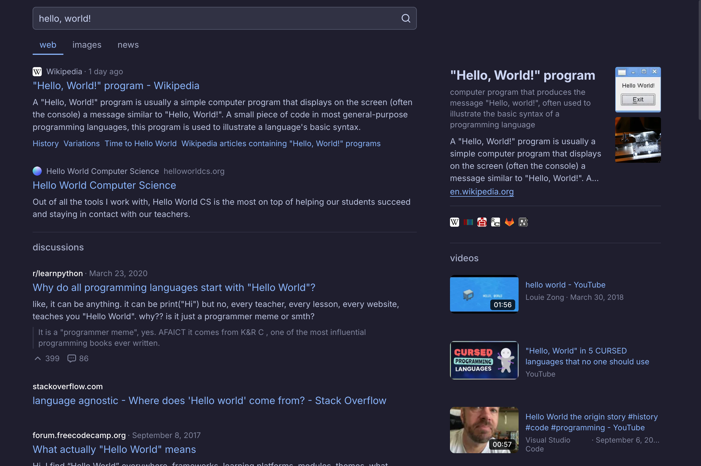

## modern, fast, privacy-first metasearch engine

[search.tiago.zip](https://search.tiago.zip) is a lightweight yet powerful metasearch engine focused on user privacy and performance. it sources data from brave search and solves challenges to provide comprehensive answers without tracking or storing user data.

### private by design

no tracking is used by default, and you can search the web with no cookies or accounts. argon2d proof-of-work is used to prevent automation and abuse

we do not log any type of data and your searches are never stored or analyzed.

### bangs, rich answers, snippets
similar to duckduckgo, you can use !bangs to search other sites directly. instant answers for calculations, weather, crypto prices, and more are available right on the results page.

### fast and better dx
unlike html-only search engines, we start by serving css and html, only sending answers in js later, which results in a much better experience.

most keyboard shortcuts are also supported, and the image tab supports a built-in ai slop remover. on chromium-based browsers, you'll also benefit from view transitions between tabs.

### rich answers

we implement most of brave's rich answer features, including calculator, color picker, timer, weather, cryptocurrency prices, and more.

### self-hosting

if you'd like to self-host your own instance, you can either run the js directly with pm2 or use docker.

a prebuilt docker image will be published soon. as for hosting the javascript, cloning the repo, installing modules and running `bun run start` should be enough.

### license

all code is licensed under aGPL-v3.0. see [LICENSE](./LICENSE) for more details.
